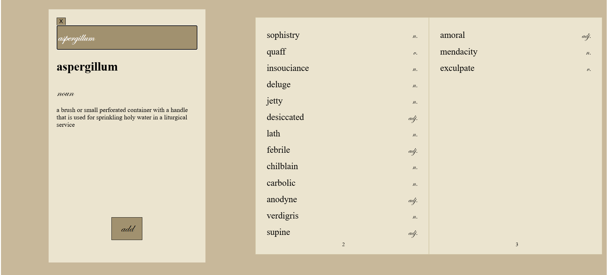

# The Wordkeep

The Wordkeep is a tool to collect words and their definitions using the Merriam-Webster API, allowing users to create their own personal dictionaries.

# Built With

   
- **react-pageflip** — interactive book UI
- **Merriam-Webster Collegiate Dictionary API** 

# Demo



# Getting Started

1. Open the URL: https://the-wordkeep.onrender.com/
2. Click on the "dictionary" button to open the left panel.
3. Type in a word in the search bar and press the "enter" key. A message will show if the word is not supported by this dictionary ("No definition found.").
4. If the word exists, click the "add" button to add it to the book. As of now, the words are not saved to the browser and will disappear if reloaded.
5. To revisit the definition of a word in the book, simply click on the word on the page.
6. Click or drag the page corners to turn the page, if applicable. No new pages will be available until the exiting pages are full.

# Contributing

## Cloning and Installation
1. Clone the repo
```
git clone https://github.com/ctln-d/the-wordkeep
```
2. Install and run backend
```
cd backend
npm install
node server.js
```
3. Install and run frontend
```
cd frontend
npm install
npm run dev
```

## Making Contributions
- Make sure to create a new branch and name it adequately
- Write clear commit messages
- When pushing changes, open a pull request and describe the changes made
